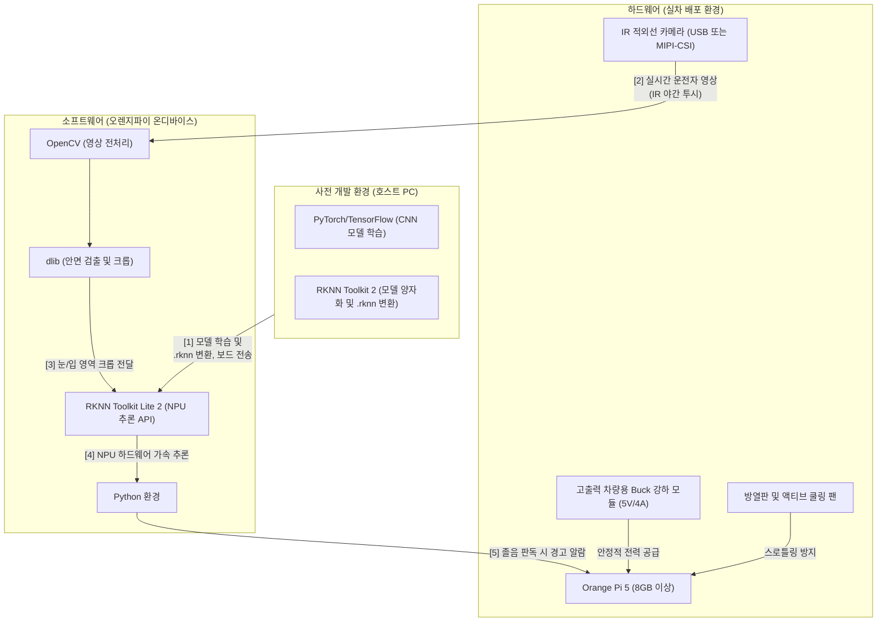

최근 자동차 내에서 졸음운전을 실시간으로 감지하고 경고하는 시스템(DSM)에 대한 관심이 높아지고 있습니다. 이 글에서는 제가 라즈베리파이 4와 오렌지파이 5를 활용하여 **온디바이스(On-device)** 환경에서 모델을 구동하는 방법을 분석하고 정리한 내용을 공유합니다. 

특히 데스크탑에서 잘 돌아가는 딥러닝 모델을 에지(Edge) 기기로 가져왔을 때 발생하는 성능 저하 문제와, 이를 NPU(신경망 처리 장치) 가속으로 극복하는 구체적인 시행 계획을 담았습니다.

---

## 1. 🍓 라즈베리파이 4 기반 구동 한계 및 요구사항

결론부터 말하면 라즈베리파이 4에서 외부 통신 없이 실시간 졸음운전을 판단하는 것은 가능하지만, **매우 엄격한 최적화**가 필수적입니다. 무거운 CNN 모델이나 `dlib`의 딥러닝 기반 얼굴 탐지기를 그대로 올리면 초당 프레임(FPS)이 1~2 수준으로 떨어져 실시간 경고가 불가능해집니다.

### 주요 요구사항
- **하드웨어**: Raspberry Pi 4 Model B (4GB/8GB 이상 권장), 야간 투시용 IR(적외선) 카메라, 방열판 및 액티브 쿨링 팬 (발열 대비).
- **소프트웨어**: Raspberry Pi OS 64-bit, Python 3.9+, OpenCV.
- **경량화**: 모델을 구동할 때 TensorFlow나 PyTorch 원본 대신 **TensorFlow Lite (TFLite) 또는 ONNX Runtime** 등으로 변환하여 CPU 연산에 최적화해야 합니다.
- **하이브리드 어프로치**: `dlib`의 초경량 68개 랜드마크 기반(EAR/MAR) 고전 피처 추출 기법과 가벼운 CNN 분류기를 결합하는 것이 가장 안정적입니다.
- **하드웨어 가속기**: 연산 속도를 획기적으로 올리려면 Google Coral USB Accelerator 같은 외부 NPU 장착이 필요합니다.

---

## 2. 🍊 오렌지파이 5 기반 구동 분석 (내장 NPU의 힘)

라즈베리파이 4가 어떻게든 경량화를 해내야 하는 환경이라면, 오렌지파이 5 (Rockchip RK3588 계열 탑재)는 **여유롭게 실시간 딥러닝 비전 처리가 가능한 고성능 보드**입니다. 핵심은 보드에 아예 내장되어 있는 고성능 NPU입니다.

### 강력한 성능 요소
- **CPU & GPU**: ARM 빅리틀 구조 8코어(Rockchip RK3588S)의 강력한 기본 성능.
- **6 TOPS NPU 내장**: 딥러닝 비전 모델(객체 검출 등)의 속도를 라즈베리파이 대비 수 배에서 수십 배 끌어올리는 초당 6조 번 연산 능력.
- **RKNN 전용 툴킷 필수**: 아무리 NPU가 좋아도 기존 모델을 그대로 돌리면 CPU가 연산합니다. 반드시 `RKNN (Rockchip NPU Toolkit)`을 이용해 전용 포맷인 `.rknn`으로 모델을 변환(양자화)해야만 프레임 드랍 없는 실시간 인식(20~30 FPS)이 가능해집니다.

### ⚠️ 사전에 대비해야 할 지뢰밭
- **발열(스로틀링)**: 하드웨어를 풀로드 시 10~20초 안에 80도를 돌파하므로 **전용 알루미늄 방열판과 쿨링팬 무조건 장착**.
- **전력 공급**: 공식 규격인 5V/4A (20W) 전원 어댑터가 필수이며, 실차(자동차) 장착 시 전압이 출렁이지 않도록 고출력 차량용 강하(Buck) 모듈 컨버터가 반드시 필요합니다.

---

## 3. 🧠 RKNN이란 무엇인가요? (핵심 개념 파헤치기)

오렌지파이를 다루다 보면 끊임없이 마주치는 단어가 바로 **RKNN**입니다.

**RKNN(Rockchip Neural Network)**은 중국의 반도체 기업인 **Rockchip(락칩)**에서 만든 프로세서(NPU)에서 인공지능 모델을 효율적으로 실행할 수 있도록 변환된 **전용 파일 형식(`.rknn`)이자 소프트웨어 도구**를 의미합니다.

우리가 흔히 아는 AI 모델(TensorFlow, PyTorch 등)은 PC나 서버용으로 만들어져서 덩치가 아주 큽니다. 이를 스마트TV, 태블릿, 드론 같은 작은 기기(임베디드 기기)에 그대로 넣으면 너무 무겁고 느립니다. 그래서 락칩 기기가 이해할 수 있는 '전용 언어'로 압축하고 번역한 것이 바로 RKNN입니다.

### 왜 RKNN이 필요한가요? (핵심 이유 3가지)

1.  **속도가 비약적으로 빨라집니다 (최적화)**
    일반적인 CPU가 수학 문제를 하나씩 푼다면, 락칩 안에 들어있는 **NPU(신경망 처리 장치)**는 수천 개의 문제를 동시에 푸는 수학 천재와 같습니다. RKNN은 AI 모델이 이 '수학 천재(NPU)'를 백분 활용할 수 있게 연산 구조를 재배열해 줍니다.
2.  **기기의 부담을 줄여줍니다 (경량화)**
    원본 모델의 복잡한 실수(Float) 연산 과정을 정수 연산(Quantization) 등으로 단순화합니다. 결과적으로 메모리 사용량은 줄어들고, 기기에서 발생하는 열도 적어지며 배터리 소모도 극적으로 아낄 수 있습니다.
3.  **인터넷 없이도 AI가 작동합니다 (Edge AI)**
    클라우드 서버에 카메라 데이터를 보내서 결과를 받아올 필요 없이, 기기 자체에서 즉시 AI 연산을 처리할 수 있게 합니다. 보안이 중요한 CCTV나 반응 속도가 즉각적이어야 하는(Low Latency) 졸음 방지 시스템, 자율주행 드론 등에 필수적입니다.

### RKNN 도입은 어떤 과정을 거치나요?

보통 다음과 같은 3단계 흐름으로 작업이 진행됩니다.
1.  **모델 학습**: 호스트 PC(데스크탑)에서 TensorFlow나 PyTorch로 AI 모델 뼈대를 만들고 학습시킵니다.
2.  **RKNN 변환**: 데스크탑에 설치한 `rknn-toolkit`이라는 도구를 사용해 원본 모델(`.h5`, `.pt`, `.onnx`)을 `.rknn` 파일로 변환(번역 및 양자화)합니다. 이 과정에서 호환성 에러가 가장 많이 나므로 꼼꼼한 테스트가 필요합니다.
3.  **실행**: 변환된 `.rknn` 파일을 오렌지파이(Rockchip 칩셋 탑재 기기)에 옮겨 담아 파이썬이나 C++ API로 불러와 실행합니다.

**요약하자면:** RKNN은 락칩(Rockchip)이라는 특정 하드웨어에서 AI가 *"더 빠르고, 가볍고, 똑똑하게"* 움직일 수 있도록 만들어주는 **기기 전용 맞춤복**이라고 이해하시면 됩니다!

---

## 4. 🚗 오렌지파이 기반 졸음운전 예방 시스템 시행계획서

저는 오렌지파이 5, `dlib`, CNN 모델, RKNN 시스템을 결합하여 실차에서 테스트하기 위해 다음과 같은 5단계의 상세 시행 계획을 세웠습니다.

### 🏗️ 전체 구성도

### 📋 상세 실행 단계 (Phase 1 ~ 5)

1.  **Phase 1: 하드웨어 및 기본 환경 구축 (설비 단계)**
    *   오렌지파이 5 보드와 전용 쿨링팬 조립, Ubuntu/Debian OS 플래싱.
    *   초기 원격 접속 세팅 빛 5V/4A 전원 어댑터 연결 등 전력 부하 테스트.
2.  **Phase 2: 데이터셋 및 Host PC 모델 개발 (학습 단계)**
    *   강력한 성능의 데스크탑 PC 환경에서 주야간 IR 얼굴 데이터를 정제.
    *   PyTorch/TensorFlow를 사용해 눈 깜박임, 하품 등을 판단하는 **파라미터가 적은 가벼운 구조(MobileNet 등)의 CNN 모델 확립** 및 학습 진행.
3.  **Phase 3: NPU 최적화 및 모델 변환 (변환 단계 - ⭐️가장 중요)**
    *   테스크탑 PC에 `RKNN Toolkit 2`를 설치하고, 학습된 모델 구조를 양자화(비트 압축)하여 **`.rknn` 파일로 변환 수행**.
    *   이 변환 과정이야말로 락칩 NPU에서 돌아가게 만드는 전용 맞춤복 제작 과정입니다.
4.  **Phase 4: 오렌지파이 온디바이스 이식 및 파이프라인 개발 (통합 단계)**
    *   오렌지파이 내부 개발: `OpenCV`로 캠 영상을 받고 -> `dlib`로 얼굴 주요 부위를 크롭해서 -> NPU 전용 API(`rknn-toolkit-lite2`)에 밀어 넣어 판독합니다.
    *   멀티 스레딩을 적용해 안정적인 20~30 FPS를 달성합니다.
5.  **Phase 5: 실차 환경 테스트 및 파인튜닝 (검증 단계)**
    *   차량 대시보드 카메라 고정 및 시동 전압을 견딜 수 있는 차량용 버벅 모듈 연결.
    *   실제 환경(낮 시간의 빛번짐, 터널 등 야간 IR) 데이터 획득 후 파인튜닝을 통해 지속적 버전 업그레이드.

### 💡 마무리하며
온디바이스 AI 환경 구축은 "PC 코드를 그대로 옮겨 심는" 단순한 이식이 아닙니다. 하드웨어의 자원 제약(발열, 전압, 메모리 대역폭)을 십분 이해하고, **특히 RKNN과 같은 NPU 아키텍처 특화 컴파일러를 얼마나 능숙하게 활용하여 최적화를 이뤄내느냐**가 실전 AI 프로젝트 완성의 핵심 열쇠임을 배웠습니다.

---

## 📸 실행 결과 (Execution Results)

실제 구동을 테스트하며 인식된 결과 화면입니다.

*눈/입 랜드마크 인식 및 졸음(Drowsiness) 감지 경고 화면*

*실시간 모니터링 파이프라인 작동 테스트 화면*
